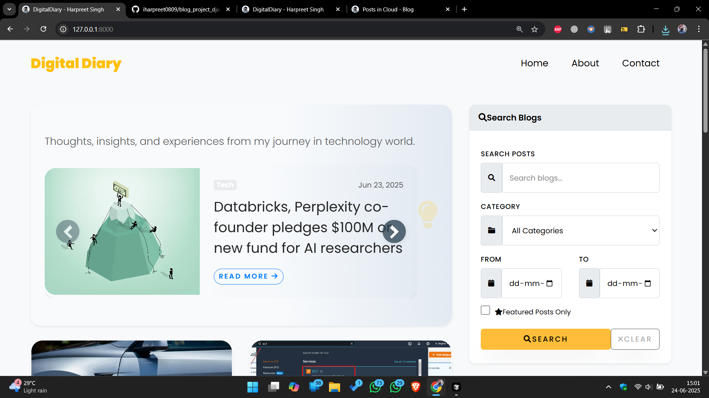
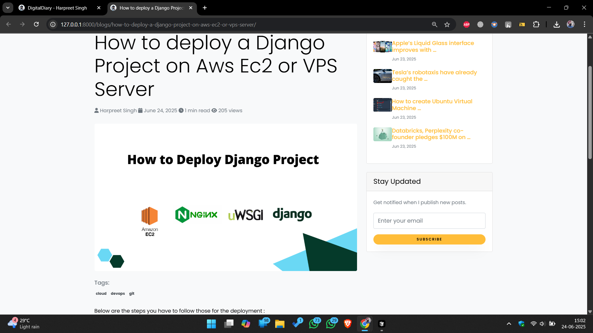
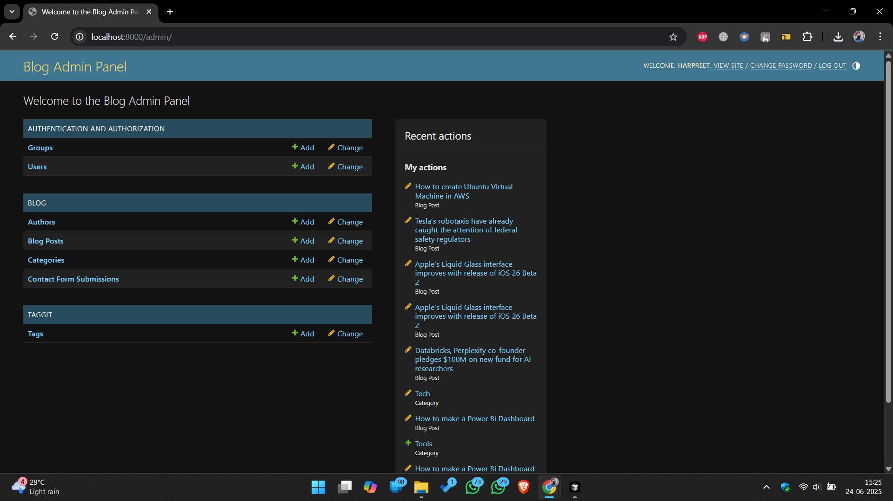

# blog_project_django
This is the Full fledged Blogging project in Django with mysql

---

## Getting Started

### Prerequisites

- Python 3.8+
- pip (Python package manager)
- MySQL server
- (Optional) Virtual environment tool (e.g., `venv` or `virtualenv`)

### Installation

1. **Clone the repository:**
   ```bash
   git clone https://github.com/yourusername/blog_project_django.git
   cd blog_project_django
   ```

2. **Create and activate a virtual environment:**
   ```bash
   python -m venv env
   source env/bin/activate  # On Windows: env\Scripts\activate
   ```

3. **Install dependencies:**
   ```bash
   pip install -r requirements.txt
   ```

### Database Setup

1. **Create a MySQL database and user:**
   ```sql
   CREATE DATABASE blog_db CHARACTER SET UTF8;
   CREATE USER 'blog_user'@'localhost' IDENTIFIED BY 'your_password';
   GRANT ALL PRIVILEGES ON blog_db.* TO 'blog_user'@'localhost';
   FLUSH PRIVILEGES;
   ```

2. **Configure database settings in `blog_project/settings.py`:**
   ```python
   DATABASES = {
       'default': {
           'ENGINE': 'django.db.backends.mysql',
           'NAME': 'blog_db',
           'USER': 'blog_user',
           'PASSWORD': 'your_password',
           'HOST': 'localhost',
           'PORT': '3306',
       }
   }
   ```

3. **Apply migrations:**
   ```bash
   python manage.py makemigrations
   python manage.py migrate
   ```

### Running the Project

1. **Create a superuser for the admin panel:**
   ```bash
   python manage.py createsuperuser
   ```

2. **Run the development server:**
   ```bash
   python manage.py runserver
   ```

3. **Access the site:**
   - Blog: [http://localhost:8000/](http://localhost:8000/)
   - Admin: [http://localhost:8000/admin/](http://localhost:8000/admin/)

---

## Usage

- Visit the homepage to see the list of blog posts.
- Click on a post to view its details.
- Use the admin panel to add/edit/delete posts, categories, and tags.
- Upload images for blog covers and author profiles.
- Use the contact form to send messages (configure email settings as needed).

---

## Screenshots

<!-- Add screenshots here -->
#1. Home Page


#2. Blog Detail


#3. Admin Panel


---

## Contributing

Contributions are welcome! Please open issues or submit pull requests for improvements or bug fixes.

---

## License

This project is licensed under the [GPU License](LICENSE).

---

## Contact

| <a href="https://www.linkedin.com/in/harpreet22/" target="_blank"></a> | [](mailto:talkwithharpreet@gmail.com) |
|:---:|:---:|

---
